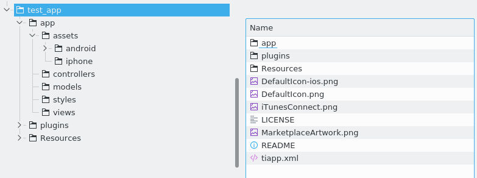
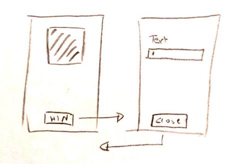
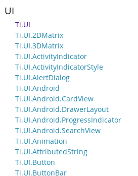
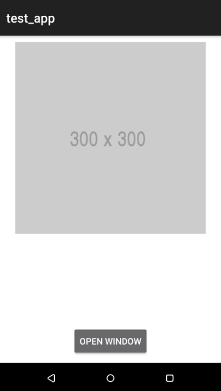
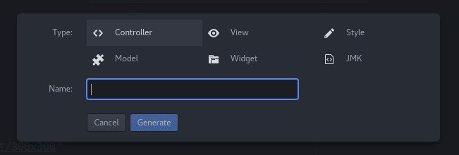

# From zero to app

## First app

In this tutorial we will create a first `Hello World` app with Axway Appcelerator.
We will use the command line tools or Atom and not [Appcelerator Studio](https://platform.appcelerator.com/) to create and compile our projects.

## Project setup
To create a new project (a so called Alloy project) we run the following command:

```bash
appc new
```

and you can select `Titanium App` and `Titanium SDK` inside the menu. After that you set your project name which will also be the folder and app name. You can change the app name once the project is created of course. At the end you need to give your app an application ID or bundle identifier. This ID is needed by the App stores to identify your app and it has to be unique. Think of it like a domain URL. You are free to use whatever you like here but normally you would use something like `com.CompanyName.AppName` here. The project folder will be created now and say "no" the last question about `Hyperloop` since we won’t use it in this tutorial. Open this folder in Atom.
If you have an Android phone connected to your machine you can run
```bash
appc run -p android -T device
```
inside the root folder of your project and it will compile, install and run the demo app on your phone. You should see a Label and when you click on it an alert dialog will pop-up.

## Folder structure
A new project already contains a demo project and all necessary folders to create the first app. Your project looks like this at the beginning:


| / | In this folder is the main configuration file "tiapp.xml". It contains basic information about your app. Also the iOS app icons are in this folder |
| /app | Here are all files you’ve created and you will work with|
| /app/assets/ | All your external data like images, videos, pdf, fonts,… will go into this folder. |
| /app/assets/images | Create this folder when you work with images. You can reference them later with "/images/image.jpg" |
| /app/assets/android | The Android app icon and the splashscreen are inside this folder. Also density related folders. |
| /app/controllers | Contains all your code files (Javascript files) |
| /app/models | Models: database structure files |
| /app/styles | TSS styling files (like CSS for Webpages) |
| /app/views | XML files of your views |
| /plugins | system folder |
| /resources | system folder |
| /build | When you compile your app this folder will appear. It contains building related files |

It looks like a lot at the beginning but the structure (MVC, model view controller) is very useful to keep your project clean and other developers know where the files are. Most of the time you will work in controllers, views and styles.
As said before a new project already contains a demo app, so the /app/controllers/index.js, /app/styles/index.tss and /app/views/index.xml file contains some code. These are the first files that are executed when you run the app. The XML file describes the elements in you will see, the TSS file the look and feel (colors, position, width, height,…) and the JS file contains your code. If you create a new controller (e.g. to open a new window) it will generate the view and style automatically. So if you create a controller called "secondWindow" the files will be called: secondWindow.js, secondWindow.tss and secondWindow.xml inside the views/styles/controllers folder.

### Views / XML files
The XML files inside the /views folder contain the components that are visible on your screen. These elements can be a Label to display text, a TextField to input text, an ImageView that shows an image or many other components like Maps, VideoPlayers, ….  Have a look at the KitchenSink Demo app by Appcelerator or the documentation at http://docs.appcelerator.com/platform/latest/#!/api (UI section) for a complete list of elements you can use. The first index.xml look like this:
```xml
<Alloy>
	<Window class="container">
			<Label id="label" onClick="doClick">Hello, World</Label>
	</Window>
</Alloy>
```
If you have a background in web development you will see some similarities. The demo app opens a new <Window> and displays a `<Label>` with the text Hello, World and when you click on it the function `doClick` will be called in the index.js controller. The class will be used for styling the window and the ID is used to reference the Label inside the controller or style file. 
You can remove the `<Label>` row to start with a blank window.

### Styles / TSS files
TSS files are similar to CSS files with some differences in the syntax. When you open the index.js you will see:
```
".container": {
	backgroundColor:"white"
}

"Label": {
	width: Ti.UI.SIZE,
	height: Ti.UI.SIZE,
	color: "#000"
}

"#label": {
	font: {
		fontSize: 12
	}
}
```
As you can see you write `"#ID"`, `"TAG"` or `".CLASS"` followed by : and {}. Inside the curly brackets you write your styles separated by commas. The available properties are listed in the documentation whe you click on an UI component and look under the "properties" section. E.g. for a Label it would be: http://docs.appcelerator.com/platform/latest/#!/api/Titanium.UI.Label. 
Each tss file contains styles that are connected to the view with the same name. There is a special file called "app.tss" that is a global style file. All styles inside this file are applied to all views. For example you can put
```
"Window": {
	backgroundColor: '#fff'
}
```
inside app.tss to make all Windows have white backgrounds.

### Controllers / JS files
The controller/ folder contains normal Javascript files. The demo index.js contains the onClick function from the index.xml and a call to open the window
```javascript
function doClick(e) {
	alert($.label.text);
}
$.index.open();
```
To reference elements from the views you will use $.ID. Then you can access the properties and methods from this element. If you removed the <Label> line from the view you can also remove the doClick function from the controller. Leave the $.index.open() so it still opens the now empty window. All methods and events are listed at the API documentation at http://docs.appcelerator.com/platform/latest/#!/api. 

## Getting started
When you start a new app most of the time you have a layout or an idea in mind how the app should look like and what the features are you want to use it for. That is why we start in the view first and add the elements we want to show. After that we style them: move them around the screen, resize them and change colors. At the end we add the code so the user can interact with the app.  Our "Hello Word" app should display an image, text and a button. When you click the button a second window will appear with a text field the user can add some text and another button that will close the window again.


To display an image we use the `<ImageView>` component and a normal button is just called `<Button>`. In an Alloy project you can can add these elements to the view. A different approach is to create the elements in the controller. Older Titanum projects (called classic projects) did not use the MVC structure so you had to create all elements in code. Sometimes you will still need to do this so both ways are described here but we will use the XML in all other examples.
XML way
Open the index.xml and add a `<Window>`, `<ImageView>` and a `<Button>` to this file. Give the last two elements an unique ID since we want to style them:
```xml
<Alloy>
		<Window>
			<ImageView id="img1"/>
			<Button id="btn1" title="open window"/>
	</Window>
</Alloy>
```
Classic way
To create the same structure in your controller you keep the XML file empty (just the keep the `<Alloy>` element) and add the following code to the index.js controller:
```javascript
var win = Ti.UI.createWindow({});
var img1 = Ti.UI.createImageView({});
var btn1 = Ti.UI.createButton({title:"open window"});
win.add(img1);
win.add(btn1);
win.open();
```
As you can see it uses the same element name e.g. "Button" and adds "create" to it, followed by ({}) where you can add the properties we will add to the TSS file later on. The Ti.UI. is the so called namespace the element is located at. The UI elements are in Ti.UI or Titanium.UI as listed in the documentation:
	


Elements are not added to the window automatically so you need to call the add() method of the window and add the elements as a parameter. The method open() will open the window.
The advantages of the XML way are less code (less errors) and more structure.
Styles
Now that we have the elements in our scene we need to style them. The image should be at the top of the window and the bottom at the bottom. Elements that do not have a position (top, left, bottom, right) are placed in the center of the screen. As soon as you give them a position they are placed absolute inside their parent element (e.g. our window).
```
"Window" : {
	backgroundColor: "white"
}
"#img1" : {
	top: 10,
	width: 300,
	height: 300,
	image: "http://placehold.it/300x300"
}
"#btn1" : {
	bottom: 10
}
```
Now is a good time to run the app and check how it looks like on you Android phone. You can either use the Appcelerator Atom package and click on the "Play" button:


or use the console and run
```bash
appc run -p android -T device
```



To open a second window when we click on the button we need to add a second controller first. This can done in the package again by clicking on the + sign in the top right corner and select controller in the popup:



or by running 
```bash
alloy generate controller NAME
```
in the console. Call it secondWindow and it will generate a view, style and controller with the given name.
Open the secondWindow view and add a `<Window>`, `<Label>`, `<TextField>` and `<Button>`
```xml
<Alloy>
	<Window>
			<View id="view_content">
				<Label id="lbl" text="Add some text:"/>
				<TextField id="tf"/>
				<Button title="close" id="btn"/>
			</View>
	</Window>
</Alloy>
```
We add the UI elements into another `<View>` so we can place them together on the screen. In web development you would use a div element.
Since all three elements should be below each other we use the vertical layout propery. That will automatically position all elements in a new row. For the height we can use `Ti.UI.SIZE` which is an auto height option. The complete style file (secondWindow.tss) looks like this
```
"Window" : {
	backgroundColor: "#555"
}
"#view_content" : {
	height: Ti.UI.SIZE,
	layout: "vertical"
}
"#lbl" : {
	left: 10
}
"#tf" : {
	left: 10,
	right: 10,
	borderColor: "#000",
	borderWidth: 1
}
```
The textfield will be as wide as the display with a margin of 10 (left and right) and has a black border. Again: we did not use any positioning properties but a vertical layout so it will look like this at the end:


All windows are setup now and we need to write the code to open the second window and to close it again. This is done via events, in our case the click event. Two ways again to add them: inside the XML or in the controller. 
In the XML you can add `onClick="clickFunction"` to the `<Button>`. In the controller you do this with:
```javascript
$.btn1.addEventListener("click", clickFunction);
Both will call the function clickFunction when you click it. Inside that function we open the second controller:
function clickFunction(e) {
	var win2 = Alloy.createController("/secondWindow").getView();
	win2.open();
}
```
Now you can click the button in the first window and it will open the second window. On Android you can click the device back button to close the window again but we add some code to the close button in the secondWindow controller to this by click, too.
```javascript
var args = $.args;

function clickClose(e) {
	$.secondWindow.close();
}

$.btn.addEventListener("click", clickClose);
```
Run the app again and you can click the "open Window" button to open the second window and the "close" button to close it again.

## Where to go from here
You have your first functional app that uses some of the basic structure of Appcelerator Titanium. Have a look at the [KitchenSink source code](https://github.com/appcelerator/kitchensink-v2/) and the [official API documentation ](http://docs.appcelerator.com/platform/latest/#!/api) which other elements you can use. All the UI elements have examples on how to use them inside the documentation. Play around with different components and combine them to match your app layout. 
There is also a growing community at http://tislack.org/ you can join to ask questions, show your apps, report bugs or search for jobs! And if you want to dig even deeper you can have a look at the [source code of Titanium](https://github.com/appcelerator/titanium_mobile) and add features if you miss something. 
