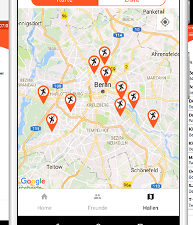
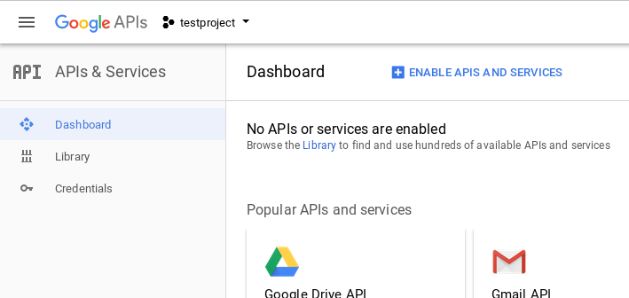

<!-- START doctoc generated TOC please keep comment here to allow auto update -->
<!-- DON'T EDIT THIS SECTION, INSTEAD RE-RUN doctoc TO UPDATE -->
**Table of Contents**  *generated with [DocToc](https://github.com/thlorenz/doctoc)*

- [From zero to app](#from-zero-to-app)
  - [Map project](#map-project)
  - [Project setup](#project-setup)
  - [Add the Map module](#add-the-map-module)
  - [Goolge API key](#goolge-api-key)
  - [Add the view](#add-the-view)
  - [Style the map](#style-the-map)
  - [Add annotations](#add-annotations)
  - [Click event](#click-event)

<!-- END doctoc generated TOC please keep comment here to allow auto update -->

# [From zero to app](https://github.com/m1ga/from_zero_to_app)
## Map project


A feature that many apps have in common is a map with annotations. This tutorial will create a basic app with a map and annotations.

## Project setup

We will start with an empty Alloy project.
```bash
appc new
```
Have a look at the last section of the [first tutorial](./first_app.md#create-a-new---clean-project).

## Add the Map module

The Map view is an external plug-in that is maintained by Axway and installed by default with when you download a Titanium SDK. To activate/include it inside your project you have to edit the `tiapp.xml` and add it to the modules section. Search for `<modules>` and at this:

```xml
<modules>
	<module>ti.map</module>
</modules>
```

This will allow you to use the module for iOS and Android.

Other external modules are added like this, too. But we will only use the Map module in this tutorial.

## Android / Goolge API key

On Android you need to have a Google API key to use the Goolge Maps. Go to https://console.developers.google.com/apis/ and create a new project.



Click on `Enable APIs and services`, search for `maps android`, click on `Google Maps Android API` and `Enable` it in the next screen.

To get the API key you go to the the `Credentials` section and create a new `API key`:


Copy the API key it will show you. For this tutorial we keep the unrestricted access but you could also configure it to only be used by your app.

This key has to go into the `tiapp.xml`. Search for the `<android xmlns:android="http://schemas.android.com/apk/res/android">` part and add the following lines (exchange `[YOUR_KEY_HERE]` with the key from above):

```xml
<android xmlns:android="http://schemas.android.com/apk/res/android">
	<manifest>
		<application>
			<meta-data android:name="com.google.android.geo.API_KEY" android:value="[YOUR_KEY_HERE]" />
		</application>
	</manifest>
</android>
```

## iOS

Add `NSLocationAlwaysUsageDescription` or `NSLocationWhenInUseUsageDescription` to your `tiapp.xml` `<plist><dict>` block:
```
 <key>NSLocationAlwaysUsageDescription</key>
        <string>
            Specify the reason for accessing the user's location information.
            This appears in the alert dialog when asking the user for permission to
            access their location.
        </string>
```
Since iOS uses the native Apple Maps you don't have to do anything else on this side.

## Add the view

In the first step we add the Map module to the global space so we can use it in all files. Open the `alloy.js` and add
```javascript
Alloy.Globals.Map = require('ti.map');
```
so we can use `Alloy.Globals.Map` globally.

In your `index.xml` we place a ``<Module>` element that is connected to the Map module and has an ID so we can access it in the style or controller:

```xml
<Alloy>
	<Window>
		<Module module="ti.map" id="view_map"></Module>
	</Window>
</Alloy>
```

If you run your project on your phone `appc ti build -p android  -T device` you will see a fullscreen map.

## Style the map
The map view has many properties you can change to adjust the look and feel. For a full overview have a look at the properties in the documentation: http://docs.appcelerator.com/platform/latest/#!/api/Modules.Map.View

One think you want to change is the initial location that will be visible. To do this you can change the `region` property and set it to a custom longitude/latitude and longitudeDelta/latitudeDelta (zooming factor).

```
"#view_map" : {
	region: {
		latitude: 52.52001,
		longitude: 13.40495,
		latitudeDelta: 1,
		longitudeDelta: 1
	}
}
```

## Add annotations


Annotations are the little pins on the map. You can add them inside your view or controller. In your XML you can do it like this:

```xml
<Alloy>
	<Window>
		<Module module="ti.map" id="view_map">
			<Annotation id="anno1" title="Anno1" subtitle="Subtitle 1" latitude="52.23" longitude="13.401"/>
			<Annotation id="anno2" title="Anno2" subtitle="Subtitle 2" latitude="52.42" longitude="13.205"/>
		</Module>
	</Window>
</Alloy>
```
`title` and `subtitle` will be visible when you click on the pins.

If you receive the coordinates via an API or want to add them in your controller you can use the following code:

```javascript
// create annotation
var an1 = Alloy.Globals.Map.createAnnotation({
	latitude: 52.23,
	longitude: 13.401,
	title: "Anno 1",
	subtitle: "Subtitle 1"
});
// create annotation
var an2 = Alloy.Globals.Map.createAnnotation({
	latitude: 52.42,
	longitude: 13.205,
	title: "Anno 2",
	subtitle: "Subtitle 2"
});

// add them to the map
$.view_map.setAnnotations([an1, an2]);

$.index.open();

```

## Click event

You have a Map with annotations. Now it would be nice to know if the user clicks on a pin and react to it. Like in the [First app tutorial](./first_app.md) we register an `event` to catch the clicks.

```javascript
function onClickMap(e){
	console.log(e.clicksource, e.annotation.title);
}
$.view_map.addEventListener("click",onClickMap);
```
When you click on a pin it will output `pin Anno 1` (the element you've click on + title of that annotation). It will also show `title`, `subtitle` or `infoWindow`. So if you want to react on the 2nd click on the popup you have to check all three cases.

If you added a custom property like `customID` you access it inside the `click` event with `e.annotation.customID`.
